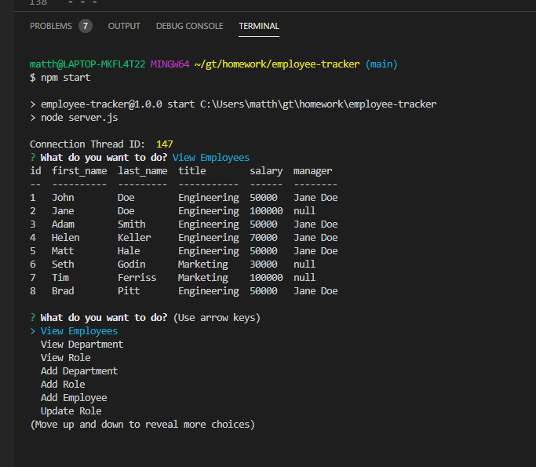

# Employee Tracker
## Description
The Employee Tracker is a command line-based content management system (CMS) for managing a company's employee information using Node.js, the Inquirer NPM package, the mysql NPM package, and a MySQL database. Users are able to add employees and identify the manager and department for an employee.
## Instructions
Use the terminal command line to do the following tasks:
- Add departments, roles, and employees
- View departments, roles, and employees
- Update employee roles

[GitHub Repo](https://github.com/matthale11/employee-tracker)

